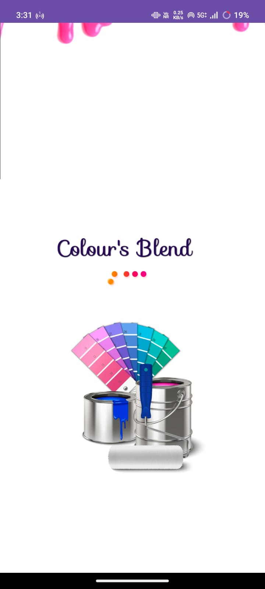
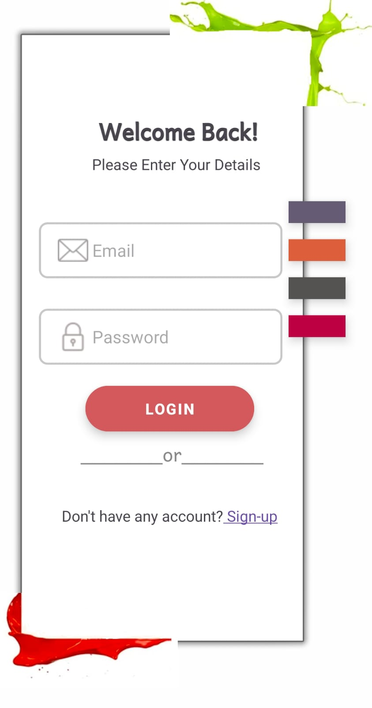
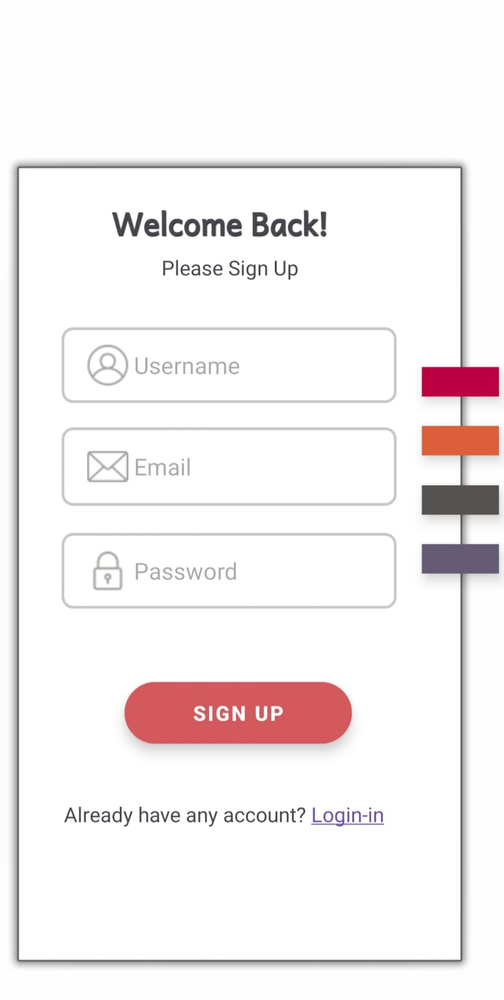

# 🎨 ColorBlendMarketplace

> Bringing Colors to Life Through Smart Interior & Painting Solutions

ColorBlendMarketplace is a modular Android marketplace application developed to connect users with interior design inspirations and professional painting services.

The application allows users to explore room interiors, detect wall colors by touch, visualize custom color changes, connect with professional painters, place paint orders, and manage data through an admin dashboard.

This project demonstrates real-world Android marketplace architecture using Java, XML, Firebase, and modular design principles.

---

# 🚀 Application Preview

## 🟣 Loading Screen

<p align="center">
  
</p>


**Overview:**
The loading screen introduces the ColorBlendMarketplace brand with a paint-themed creative interface.  
It represents:

- 🎨 Creativity and color combinations  
- 🪣 Professional painting services  
- 🌈 Interior styling inspiration  
- 🔄 Smooth startup user experience  

This screen establishes branding and enhances first impression.

---

# 📱 Core Features

- 🔐 Secure User Authentication  
- 🏠 Interactive Interior Exploration  
- 🎨 Wall Color Detection  
- 🎯 Room Color Visualization  
- 🧑‍🎨 Painter Profiles & Contact  
- 📦 Simple Paint Ordering System  
- 🛠 Admin Dashboard  
- 🔥 Firebase Integration  

---

# 🧩 Modules Overview

---

## 🔐 1. User Authentication Module

- User Registration & Login  
- Credential validation  
- Secure access control  
- Navigation based on user roles  

📸 Screenshot:

<p align="center">
  
  
</p>

---

## 🏠 2. Interior Design Module

This module displays interior room images such as:

- Kitchen  
- Hall  
- Bedroom  

### 🔎 Key Feature:
When the user touches a wall area in the room image:

- The application detects the color of that specific wall.
- It only reads the color at the touched position.
- It does NOT recolor the entire image.

This helps users understand existing wall color combinations.

📸 Screenshot:


---

## 🎨 3. Visualizing Module

This module allows users to apply their favorite colors to a selected room.

### How it works:

1. User selects a room image.
2. User selects a desired paint color.
3. User touches the wall area using their finger.
4. The selected color is applied to that part of the room.

This provides a real-time wall painting preview experience.

📸 Screenshot:


---

## 🧑‍🎨 4. Painter Module

This module connects users with professional painters.

Features:

- View painter profiles  
- View years of experience  
- See room images painted by them  
- Call painter directly  

This builds user trust and professional transparency.

📸 Screenshot:


---

## 📦 5. Order Module

This module allows users to order paints easily.

Features:

- Select paint  
- Choose quantity  
- Enter personal details  
- Place order  
- Store order details in database  

📸 Screenshot:


---

## 🛠 6. Admin Module

Accessible only by Admin.

Admin can:

- Add new paints  
- Update paint quantities  
- Manage available paints  
- View total number of orders  
- View customer details  
- Manage painter data  

Ensures centralized system control and management.

📸 Screenshot:


---

# 🛠 Tech Stack

- **Language:** Java  
- **UI Design:** XML  
- **IDE:** Android Studio  
- **Backend:** Firebase  
- **Build System:** Gradle (Kotlin DSL)  
- **Architecture:** Modular multi-package structure  

---

# 📂 Project Structure

```
ColorBlendMarketplace
│
├── app/
├── admin/
├── interiordesign/
├── painter/
├── ordermanage/
├── visualizing/
├── screenshots/
└── README.md
```

---

# 🚀 How to Run

1. Clone the repository:

```
git clone https://github.com/your-username/ColorBlendMarketplace.git
```

2. Open the project in Android Studio  
3. Sync Gradle  
4. Connect Firebase (if required)  
5. Run on Emulator or Physical Device  

---

# 🎯 Future Enhancements

- Online payment integration  
- AI-based color recommendation  
- Advanced wall segmentation  
- Painter booking system  
- User review & rating system  

---

# 👩‍💻 Developed By

**Samiksha Patil**  
Android Developer  

---

# ⭐ If You Like This Project

Give it a ⭐ on GitHub!
